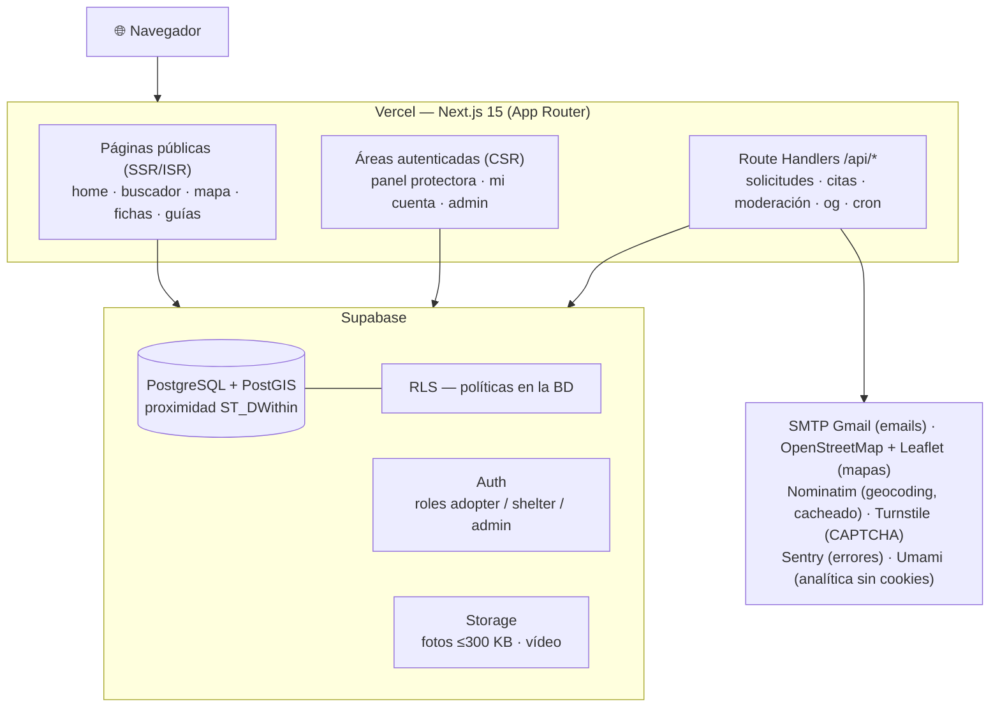

# 🐾 Adoptia

**Plataforma web que conecta protectoras de animales con personas que quieren adoptar.**

[](https://github.com/GorkaAnasinf/Adoptia/actions/workflows/ci.yml)


Las protectoras publican sus animales con fichas completas y gestionan solicitudes y citas desde un panel privado; los adoptantes buscan por proximidad en un mapa, consultan fichas y arrancan la adopción con un cuestionario guiado que sustituye al filtro telefónico manual. **Gratuito para ambos lados** y construido íntegramente sobre free tiers (**coste de operación: 0 €**).

> 📖 **[Manual de usuario](docs/manual/MANUAL_USUARIO.md)** — guía funcional completa por perfil (adoptante, protectora, administración).

---

## Índice

- [Funcionalidades](#funcionalidades)
- [Arquitectura](#arquitectura)
- [Stack y justificación](#stack-y-justificación)
- [Puesta en marcha](#puesta-en-marcha)
- [Scripts disponibles](#scripts-disponibles)
- [Calidad: tests y CI](#calidad-tests-y-ci)
- [Despliegue](#despliegue)
- [Estructura del repositorio](#estructura-del-repositorio)
- [Documentación](#documentación)
- [Metodología de desarrollo](#metodología-de-desarrollo)

## Funcionalidades

| Perfil | Capacidades |
|--------|-------------|
| 🧑 **Adoptante** | Búsqueda con filtros y por cercanía · mapa de protectoras · fichas completas con fotos/vídeo · solicitud de adopción con cuestionario de pre-adopción · citas sobre la agenda real de la protectora · favoritos · alertas por correo con baja en un clic · apadrinamiento · registro como casa de acogida · tablón de perdidos y encontrados · guías de adopción responsable |
| 🐕 **Protectora** | Alta guiada con verificación manual · gestión de animales (fotos comprimidas, vídeo, estados publicado/reservado/adoptado) · bandeja de solicitudes con cuestionario · agenda de disponibilidad y citas con recordatorios · estadísticas de actividad · imagen Open Graph automática por ficha para redes · perfil público geolocalizado · contacto con casas de acogida |
| 🛡️ **Administración** | Verificación de protectoras · moderación de contenido y cuentas · gestión de reportes · registro de auditoría |
| 🌐 **Transversal** | SEO completo (SSR/ISR, JSON-LD, sitemap, og:image) · emails transaccionales · crons (alertas, recordatorios, keepalive) · anti-spam con CAPTCHA · i18n preparada (next-intl) · RGPD sin cookies de terceros |

## Arquitectura

Aplicación **Next.js 15 (App Router)** desplegada en Vercel con **Supabase** como backend gestionado. **No hay backend separado**: la lógica de servidor vive en Server Components y Route Handlers, y la autorización se impone **en la base de datos** mediante Row Level Security (RLS) — el código asume que la BD ya protege los datos.



Decisiones estructurales clave (detalle y motivos en [DECISIONS.md](docs/technical/DECISIONS.md)):

- **SSR/ISR para SEO** — las fichas deben posicionarse ("adoptar perro en Bilbao"); el panel privado es CSR.
- **RLS como pilar de seguridad** — toda tabla lleva políticas y tests de acceso permitido/denegado.
- **Geocoding solo en escritura** — Nominatim se llama al guardar direcciones; las coordenadas se persisten y las búsquedas por proximidad las resuelve PostGIS.
- **Media barata** — compresión de imágenes en el cliente antes de subir, `next/image` para servir, YouTube para vídeo largo.

## Stack y justificación

| Pieza | Tecnología | Por qué |
|-------|-----------|---------|
| Framework | Next.js 15 (App Router) + React 19 + TypeScript | SSR/ISR para SEO, Server Components, un solo despliegue para web y API |
| UI | Tailwind CSS 4 + shadcn/ui + lucide-react | Sistema de diseño consistente sin coste de mantenimiento de una librería propia |
| Backend gestionado | Supabase (PostgreSQL + PostGIS, Auth, Storage) | BD relacional con geoespacial, auth y ficheros en un solo servicio con free tier generoso |
| Seguridad | RLS + Zod (validación compartida cliente/servidor) + Cloudflare Turnstile | Autorización en la BD, una sola fuente de validación, anti-bots sin fricción |
| Formularios | React Hook Form + Zod | Validación tipada reutilizada en los Route Handlers |
| Mapas | Leaflet + OpenStreetMap (+ markercluster) | Sin API key ni coste; carga con `dynamic import` sin SSR |
| Emails | Nodemailer + SMTP de Gmail | Transaccionales a coste 0 con plantillas propias (Decisión #22) |
| i18n | next-intl (`messages/es.json`) | Español al lanzar; añadir un idioma = añadir un JSON |
| Observabilidad | Sentry + Umami | Errores en tiempo real y analítica sin cookies (RGPD) |
| Hosting | Vercel (Hobby) + GitHub Actions | Deploy automático por rama, previews, CI y crons gratuitos |

## Puesta en marcha

### Requisitos previos

- **Node.js 20+** y npm
- **Git**
- **Python 3.10+** (script de planificación y MkDocs; opcional para solo ejecutar la app)
- Cuenta gratuita en [Supabase](https://supabase.com)

### 1. Clonar e instalar

```powershell
git clone https://github.com/GorkaAnasinf/Adoptia.git adoptia
cd adoptia
npm install
```

### 2. Crear el proyecto de Supabase

1. Crea un proyecto en el [dashboard de Supabase](https://supabase.com/dashboard) (región `eu-west`).
2. Activa PostGIS en `Database → Extensions → postgis`.
3. Copia URL y claves desde `Settings → API`.
4. Aplica migraciones y datos de demo:

```powershell
npx supabase link --project-ref <ref-del-proyecto>
npx supabase db push        # aplica las migraciones
# opcional, entorno de demo: npx supabase db reset   (migraciones + seed.sql: 4 protectoras y 23 animales)
```

### 3. Variables de entorno

```powershell
Copy-Item .env.example .env.local
# editar .env.local con las claves reales
```

Las imprescindibles para arrancar son las tres de Supabase (`NEXT_PUBLIC_SUPABASE_URL`, `NEXT_PUBLIC_SUPABASE_ANON_KEY`, `SUPABASE_SERVICE_ROLE_KEY`). El resto (SMTP, Sentry, Umami, cron) están comentadas en [.env.example](.env.example) y detalladas en [ENVIRONMENT.md](docs/operations/ENVIRONMENT.md).

### 4. Arrancar

```powershell
npm run dev          # http://localhost:3000
```

Guía extendida con problemas comunes: [docs/operations/SETUP.md](docs/operations/SETUP.md)

## Scripts disponibles

| Comando | Qué hace |
|---------|----------|
| `npm run dev` | Servidor de desarrollo (Turbopack) en `http://localhost:3000` |
| `npm run build` | Build de producción |
| `npm run start` | Sirve el build de producción |
| `npm run lint` | ESLint |
| `npm run typecheck` | Comprobación de tipos (`tsc --noEmit`) |
| `npm run test` | Suite de tests con Vitest (una pasada) |
| `npm run test:watch` | Tests en modo watch |
| `npm run e2e` | Tests end-to-end con Playwright |
| `python scripts/render_planning.py` | Regenera las vistas de planificación (BACKLOG, ROADMAP, catálogo) |
| `mkdocs serve` | Sitio de documentación en `http://localhost:8000` |

## Calidad: tests y CI

El proyecto se desarrolla con **TDD estricto**: todo código de producción nace de un test que falla (metodología en [TESTING.md](docs/meta/TESTING.md)).

- **Unitarios y de componentes** — Vitest + Testing Library (jsdom).
- **Tests de RLS** — cada tabla tiene tests de acceso *permitido y denegado* contra un stack local de Supabase (`npx supabase start`), verificando que las políticas de seguridad hacen lo que dicen.
- **End-to-end** — Playwright sobre los flujos críticos.
- **CI (GitHub Actions)** — lint, typecheck y tests con **umbral de cobertura ≥ 70 %** en cada push; el pipeline bloquea merges en rojo. Workflows adicionales ejecutan los crons de alertas y recordatorios y el keepalive de Supabase.

## Despliegue

| Rama | Entorno |
|------|---------|
| `main` | Producción (Vercel) |
| `develop` | Preview automático (Vercel Preview Deployments) |

1. Importar el repo en Vercel (framework autodetectado) y configurar las variables de entorno de `.env.example` en Production + Preview.
2. Aplicar migraciones al proyecto Supabase de producción (`npx supabase db push`).
3. Configurar secrets: `SITE_URL` y `CRON_SECRET` en GitHub Actions y `CRON_SECRET` en Vercel (protegen los endpoints `/api/cron/*`).

Detalle operativo: [OPERATIONS.md](docs/operations/OPERATIONS.md) · [RUNBOOKS.md](docs/operations/RUNBOOKS.md)

## Estructura del repositorio

```
adoptia/
├── docs/                      # documentación completa (MkDocs): producto, técnica, planificación, operación
│   └── manual/                # manual de usuario
├── messages/es.json           # textos de UI (next-intl) — nunca hardcodeados
├── scripts/                   # render_planning.py (vistas de planificación)
├── supabase/
│   ├── migrations/            # SQL versionado (esquema + políticas RLS)
│   └── seed.sql               # datos de demo
├── src/
│   ├── app/
│   │   ├── (public)/          # home, buscador, mapa, fichas, guías, perdidos, legales
│   │   ├── (adopter)/         # mi cuenta: solicitudes, citas, favoritos, alertas
│   │   ├── (shelter)/panel/   # animales, solicitudes, agenda, citas, estadísticas, perfil, acogida
│   │   ├── (admin)/           # verificación, moderación, reportes, auditoría
│   │   ├── (auth)/            # login, registro, recuperación, verificación de correo
│   │   └── api/               # Route Handlers: solicitudes, citas, admin, og, cron, geocode...
│   ├── components/            # ui/ (shadcn), dominio (animales, mapa, formularios)
│   ├── content/               # contenido editorial (guías de adopción)
│   ├── i18n/                  # configuración de next-intl
│   ├── lib/                   # clientes Supabase, esquemas Zod, email, utilidades
│   └── test/                  # utilidades de test
└── .github/workflows/         # ci.yml, keepalive.yml, alertas.yml, recordatorios.yml
```

## Documentación

Toda la documentación vive en [docs/](docs/) y se navega con `mkdocs serve`:

- 📖 **[Manual de usuario](docs/manual/MANUAL_USUARIO.md)** — la plataforma explicada por perfiles
- 🧭 **[Contexto de producto](docs/product/PRODUCT_CONTEXT.md)** — punto de entrada del conocimiento del producto
- 🔧 **[Arquitectura](docs/technical/ARCHITECTURE.md)** · **[Modelo de datos](docs/technical/DATA_MODEL.md)** · **[Contratos de API](docs/technical/API_CONTRACTS.md)** · **[Decisiones](docs/technical/DECISIONS.md)**
- 🔐 **[Seguridad](docs/operations/SECURITY.md)** · **[Privacidad / RGPD](docs/meta/PRIVACY.md)**
- 📍 **[Backlog](docs/planning/BACKLOG.md)** (estado actual) · **[Roadmap](docs/planning/ROADMAP.md)** · **[Changelog](docs/planning/CHANGELOG.md)**
- ⚙️ **[Setup](docs/operations/SETUP.md)** · **[Entornos](docs/operations/ENVIRONMENT.md)** · **[Testing](docs/meta/TESTING.md)**

## Metodología de desarrollo

El proyecto sigue un flujo **SDD (Spec-Driven Development)** orquestado por agentes (la *Manada*, ver [CLAUDE.md](CLAUDE.md)): cada petición se clasifica, se especifica y planifica en un item de `docs/planning/items/`, se aprueba, se implementa con TDD, pasa QA y se documenta antes de cerrarse. Las vistas de planificación se regeneran con `python scripts/render_planning.py`.

- **Gitflow sin PRs**: ramas `feature/<ID>-slug` desde `develop`; merge a `develop` y de ahí a `main`. Nunca commits directos a `main`.
- **Commits**: [Conventional Commits](https://www.conventionalcommits.org/es/) en español.
- Convenciones completas: [CONTRIBUTING.md](CONTRIBUTING.md) · Política de seguridad: [SECURITY.md](SECURITY.md)

---

Proyecto desarrollado como **Trabajo de Fin de Máster**. Hecho con 🧡 por los animales que esperan un hogar.
