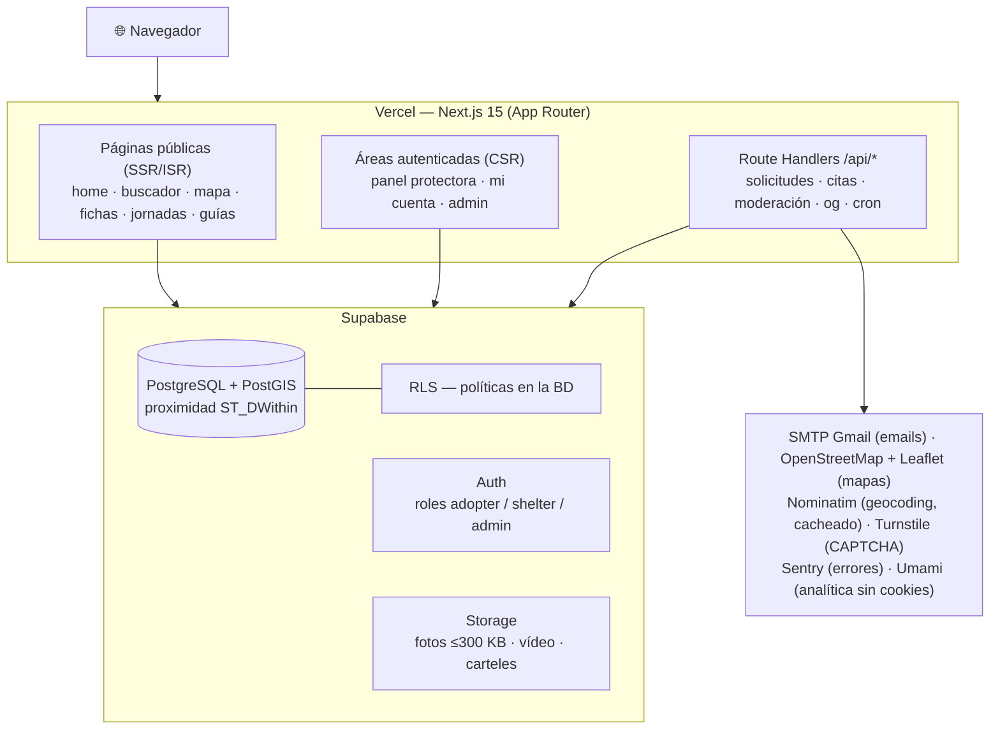

# 🐾 Adoptia

**Plataforma web que conecta protectoras de animales con personas que quieren adoptar.**

[](https://github.com/GorkaAnasinf/Adoptia/actions/workflows/ci.yml)


<br>
-success?logo=vitest&logoColor=white)


### 👉 **[Ver la aplicación en vivo](https://adoptia-eight.vercel.app)** · 📖 **[Manual de usuario](docs/manual/MANUAL_USUARIO.md)** · 📚 **[Documentación](docs/)**

---

## El problema

Adoptar un animal hoy es un proceso disperso. Los animales se anuncian en Instagram y Facebook, el contacto va por teléfono o mensaje privado, cada protectora hace su propio filtro manual de candidatos y las citas se conciertan a mano. El resultado son animales con poca visibilidad, protectoras saturadas de trabajo administrativo y adoptantes que abandonan por pura fricción.

**Adoptia sustituye ese circuito por uno solo:** las protectoras publican fichas completas e indexables en Google y gestionan solicitudes y citas desde un panel privado; los adoptantes buscan por proximidad en un mapa y arrancan la adopción con un cuestionario guiado que hace el primer filtro **antes** de que la protectora intervenga.

Gratuito para ambos lados y construido íntegramente sobre free tiers: **coste de operación 0 €**, sin tarjeta de crédito en ningún servicio.

## El proyecto en cifras

| | |
|---|---|
| **110 items** de planificación · 109 cerrados | 65 features · 35 mejoras · 10 bugs, cada uno con su spec y sus criterios de aceptación |
| **44 migraciones** SQL versionadas | 28 tablas, todas con políticas RLS |
| **1.280 tests** | 1.078 unitarios/componentes + 202 de RLS contra Postgres real |
| **57 decisiones** de arquitectura | registradas con fecha, motivo y alternativa descartada |
| **≥70 % de cobertura** | umbral que bloquea el merge en CI |
| **0 €/mes** | Vercel Hobby + Supabase Free + OpenStreetMap + SMTP Gmail |

---

## Índice

- [Funcionalidades](#funcionalidades)
- [Arquitectura](#arquitectura)
- [Seguridad](#seguridad)
- [Stack y justificación](#stack-y-justificación)
- [Puesta en marcha](#puesta-en-marcha)
- [Scripts disponibles](#scripts-disponibles)
- [Calidad: tests y CI](#calidad-tests-y-ci)
- [Despliegue](#despliegue)
- [Estructura del repositorio](#estructura-del-repositorio)
- [Documentación](#documentación)
- [Metodología de desarrollo](#metodología-de-desarrollo)

## Funcionalidades

### 🧑 Adoptante

| | |
|---|---|
| **Buscar** | Filtros por especie, tamaño, edad, sexo, compatibilidad (niños/perros/gatos), «apto para piso» y «solo urgentes» · búsqueda por cercanía sobre mapa · directorio y mapa de protectoras |
| **Decidir** | Ficha completa con galería, vídeo, notas de salud y necesidades especiales · perfil público de la protectora con sus estadísticas · guías de adopción responsable |
| **Adoptar** | Solicitud con cuestionario de pre-adopción · seguimiento del estado · reserva de cita sobre la agenda real de la protectora, con recordatorio por correo |
| **Seguir la pista** | Favoritos · alertas por correo con zona y filtros, y baja en un clic |
| **Implicarse** | Apadrinamiento · registro como casa de acogida y respuesta a propuestas · tablón de perdidos y encontrados con avistamientos ciudadanos · ofrecer material a las protectoras · asistir a jornadas de adopción (RSVP) · publicar su historia feliz |

### 🐕 Protectora

| | |
|---|---|
| **Darse de alta** | Onboarding guiado en pasos, con verificación manual por el equipo antes de publicar nada |
| **Publicar** | Gestión de animales con fotos comprimidas en cliente y vídeo · estados publicado/reservado/adoptado/en acogida/borrador · badge de urgencia · imagen Open Graph generada automáticamente por ficha para compartir en redes |
| **Gestionar** | Bandeja de solicitudes con el cuestionario del adoptante y notas internas · agenda de disponibilidad (franjas semanales, plantillas y excepciones) · citas con recordatorios automáticos |
| **Crecer** | Estadísticas de visitas y actividad · perfil público geolocalizado · jornadas de adopción con animales, asistentes y métricas de resultado · tablón de necesidades materiales · búsqueda de casas de acogida cercanas y propuestas con relevo · moderación de las historias felices de sus adoptantes |

### 🛡️ Administración

Verificación de protectoras · moderación de contenido y cuentas · gestión de reportes de la comunidad · registro de auditoría inmutable de toda acción administrativa.

### 🌐 Transversal

SEO completo (SSR/ISR, JSON-LD, sitemap, `og:image` por ficha) · emails transaccionales con plantillas propias · cuatro crons programados (alertas, recordatorios de cita, avisos de jornada, keepalive) · anti-spam con CAPTCHA · i18n cableada desde el día 1 (next-intl) · RGPD sin cookies de terceros.

## Arquitectura

Aplicación **Next.js 15 (App Router)** desplegada en Vercel con **Supabase** como backend gestionado. **No hay backend separado**: la lógica de servidor vive en Server Components y Route Handlers, y la autorización se impone **en la base de datos** mediante Row Level Security — el código asume que la BD ya protege los datos.


```mermaid
flowchart TB
    B["🌐 Navegador"]

    subgraph V["Vercel — Next.js 15 (App Router)"]
        PUB["Páginas públicas (SSR/ISR)<br/>home · buscador · mapa · fichas · jornadas · guías"]
        PRIV["Áreas autenticadas (CSR)<br/>panel protectora · mi cuenta · admin"]
        API["Route Handlers /api/*<br/>solicitudes · citas · moderación · og · cron"]
    end

    subgraph S["Supabase"]
        PG[("PostgreSQL + PostGIS<br/>proximidad ST_DWithin")]
        AUTH["Auth<br/>roles adopter / shelter / admin"]
        ST["Storage<br/>fotos ≤300 KB · vídeo · carteles"]
        RLS["RLS — políticas en la BD"]
    end

    EXT["SMTP Gmail (emails) · OpenStreetMap + Leaflet (mapas)<br/>Nominatim (geocoding, cacheado) · Turnstile (CAPTCHA)<br/>Sentry (errores) · Umami (analítica sin cookies)"]

    B --> V
    PUB & PRIV & API --> S
    PG --- RLS
    API --> EXT
```

Decisiones estructurales clave (las 57, con fecha y motivo, en [DECISIONS.md](docs/technical/DECISIONS.md)):

- **SSR/ISR para SEO** — las fichas deben posicionarse ("adoptar perro en Bilbao"); el panel privado es CSR.
- **RLS como pilar de seguridad** — toda tabla lleva políticas y tests de acceso permitido *y* denegado.
- **Geocoding solo en escritura** — Nominatim se llama al guardar direcciones; las coordenadas se persisten y las búsquedas por proximidad las resuelve PostGIS con índice GiST.
- **Privacidad por diseño en lo geográfico** — las ubicaciones de particulares (casas de acogida, avisos de perdidos, ofertas de donación) se redondean a una rejilla de ~200 m **al guardar**: la dirección exacta nunca llega a existir en la base de datos.
- **Media barata** — compresión de imágenes en el cliente antes de subir, `next/image` para servir, YouTube para vídeo largo.

## Seguridad

La autorización no vive en el código de la aplicación, sino en la base de datos. Cualquier consulta —venga del navegador, de un Route Handler o de una clave filtrada— pasa por las mismas políticas.

- **Row Level Security en las 28 tablas**, con tests automatizados que comprueban tanto el acceso *permitido* como el *denegado* contra un Postgres real.
- **Privilegios protegidos por trigger**: el rol de un perfil no se puede escalar desde el cliente (el alta solo admite `adopter`/`shelter`), y el estado de verificación de una protectora solo lo cambia un administrador.
- **Validación compartida**: un único esquema Zod por formulario, reutilizado en cliente y en el Route Handler, para que el servidor nunca confíe en lo que llega.
- **Registro de auditoría inmutable**: un trigger bloquea `UPDATE` y `DELETE` sobre las acciones administrativas.
- **Anti-abuso**: CAPTCHA (Cloudflare Turnstile) en los formularios públicos y límites por usuario en las tablas que un bot podría inundar.
- **Endpoints de cron protegidos** por secreto compartido.

Detalle completo: [SECURITY.md](docs/operations/SECURITY.md) · [PRIVACY.md](docs/meta/PRIVACY.md) · política de divulgación: [SECURITY.md](SECURITY.md)

## Stack y justificación

| Pieza | Tecnología | Por qué |
|-------|-----------|---------|
| Framework | Next.js 15 (App Router) + React 19 + TypeScript | SSR/ISR para SEO, Server Components, un solo despliegue para web y API |
| UI | Tailwind CSS 4 + shadcn/ui + lucide-react | Sistema de diseño consistente sin mantener una librería propia |
| Backend gestionado | Supabase (PostgreSQL + PostGIS, Auth, Storage) | BD relacional con geoespacial, auth y ficheros en un solo servicio con free tier sin expiración |
| Seguridad | RLS + Zod (validación compartida cliente/servidor) + Cloudflare Turnstile | Autorización en la BD, una sola fuente de validación, anti-bots sin fricción |
| Formularios | React Hook Form + Zod | Validación tipada reutilizada en los Route Handlers |
| Mapas | Leaflet + OpenStreetMap (+ markercluster) | Sin API key ni coste; carga con `dynamic import` sin SSR |
| Emails | Nodemailer + SMTP de Gmail | Transaccionales a coste 0 con plantillas propias (Decisión #22) |
| i18n | next-intl (`messages/es.json`) | Español al lanzar; añadir un idioma = añadir un JSON |
| Observabilidad | Sentry + Umami | Errores en tiempo real y analítica sin cookies (RGPD) |
| Hosting | Vercel (Hobby) + GitHub Actions | Deploy automático por rama, previews, CI y crons gratuitos |

## Puesta en marcha

### Requisitos previos

- **Node.js 24** (fijado en [.nvmrc](.nvmrc); `engines` exige ≥22) y npm
- **Git**
- **Python 3.10+** (script de planificación y MkDocs; opcional para solo ejecutar la app)
- Cuenta gratuita en [Supabase](https://supabase.com)
- **Docker** solo si quieres ejecutar los tests de RLS en local (`npx supabase start`)

### 1. Clonar e instalar

```powershell
git clone https://github.com/GorkaAnasinf/Adoptia.git adoptia
cd adoptia
npm install
```

### 2. Crear el proyecto de Supabase

1. Crea un proyecto en el [dashboard de Supabase](https://supabase.com/dashboard) (región `eu-west`).
2. Activa PostGIS en `Database → Extensions → postgis`.
3. Copia URL y claves desde `Settings → API`.
4. Aplica migraciones y datos de demo:

```powershell
npx supabase link --project-ref <ref-del-proyecto>
npx supabase db push        # aplica las migraciones
# opcional, entorno de demo: npx supabase db reset   (migraciones + seed.sql: 4 protectoras y 23 animales)
```

### 3. Variables de entorno

```powershell
Copy-Item .env.example .env.local
# editar .env.local con las claves reales
```

Las imprescindibles para arrancar son las tres de Supabase (`NEXT_PUBLIC_SUPABASE_URL`, `NEXT_PUBLIC_SUPABASE_ANON_KEY`, `SUPABASE_SERVICE_ROLE_KEY`). El resto (SMTP, Sentry, Umami, cron) están comentadas en [.env.example](.env.example) y detalladas en [ENVIRONMENT.md](docs/operations/ENVIRONMENT.md).

### 4. Arrancar

```powershell
npm run dev          # http://localhost:3000
```

Guía extendida con problemas comunes: [docs/operations/SETUP.md](docs/operations/SETUP.md)

## Scripts disponibles

| Comando | Qué hace |
|---------|----------|
| `npm run dev` | Servidor de desarrollo (Turbopack) en `http://localhost:3000` |
| `npm run build` | Build de producción |
| `npm run start` | Sirve el build de producción |
| `npm run lint` | ESLint |
| `npm run typecheck` | Comprobación de tipos (`tsc --noEmit`) |
| `npm run test` | Suite de tests con Vitest (una pasada) |
| `npm run test:watch` | Tests en modo watch |
| `npm run e2e` | Tests end-to-end con Playwright |
| `python scripts/render_planning.py` | Regenera las vistas de planificación (BACKLOG, ROADMAP, catálogo) |
| `mkdocs serve` | Sitio de documentación en `http://localhost:8000` |

## Calidad: tests y CI

El proyecto se desarrolla con **TDD estricto**: todo código de producción nace de un test que falla (metodología en [TESTING.md](docs/meta/TESTING.md)).

| Nivel | Herramienta | Qué cubre |
|-------|-------------|-----------|
| Unitarios y de componentes | Vitest + Testing Library (jsdom) | 1.078 tests sobre lógica, esquemas Zod, Route Handlers y componentes |
| Seguridad | Vitest contra Supabase local | 202 tests de RLS: cada tabla verifica acceso *permitido* y *denegado* contra Postgres real, no contra un mock |
| End-to-end | Playwright | Flujos críticos completos en navegador |

**CI (GitHub Actions)** ejecuta lint, typecheck, tests y auditoría de dependencias en cada push, con **umbral de cobertura ≥ 70 %**; el pipeline bloquea el merge en rojo. Tres workflows adicionales ejecutan los crons de alertas, recordatorios de cita y avisos de jornada, más el keepalive que evita la hibernación del proyecto Supabase gratuito.

> Los 202 tests de RLS requieren Docker (`npx supabase start`). Sin él se saltan en silencio en local, pero **en CI se ejecutan siempre** — que dejaran de correrse fue un bug real ([BUG-007](docs/planning/items/BUG-007.md)) y ahora el pipeline lo vigila.

## Despliegue

| Rama | Entorno |
|------|---------|
| `main` | Producción (Vercel) — cada `push` despliega |
| `feature/*` · `fix/*` | Preview automático por rama (Vercel Preview Deployments) |

1. Importar el repo en Vercel (framework autodetectado) y configurar las variables de entorno de `.env.example` en Production + Preview.
2. Aplicar migraciones al proyecto Supabase de producción (`npx supabase db push`).
3. Configurar secrets: `SITE_URL` y `CRON_SECRET` en GitHub Actions y `CRON_SECRET` en Vercel (protegen los endpoints `/api/cron/*`).

Detalle operativo: [OPERATIONS.md](docs/operations/OPERATIONS.md) · [RUNBOOKS.md](docs/operations/RUNBOOKS.md)

## Estructura del repositorio

```
adoptia/
├── docs/                      # documentación completa (MkDocs): producto, técnica, planificación, operación
│   ├── manual/                # manual de usuario
│   └── planning/items/        # 110 items: la fuente de verdad de la planificación
├── messages/es.json           # textos de UI (next-intl) — nunca hardcodeados
├── scripts/                   # render_planning.py (vistas de planificación)
├── supabase/
│   ├── migrations/            # 44 migraciones SQL (esquema + políticas RLS)
│   └── seed.sql               # datos de demo
├── src/
│   ├── app/
│   │   ├── (public)/          # home, buscador, mapa, fichas, jornadas, guías, perdidos, legales
│   │   ├── (adopter)/         # mi cuenta: solicitudes, citas, favoritos, alertas, acogida
│   │   ├── (shelter)/panel/   # animales, solicitudes, agenda, citas, jornadas, estadísticas, perfil
│   │   ├── (admin)/           # verificación, moderación, reportes, auditoría
│   │   ├── (auth)/            # login, registro, recuperación, verificación de correo
│   │   └── api/               # Route Handlers: solicitudes, citas, admin, og, cron, geocode...
│   ├── components/            # ui/ (shadcn), dominio (animales, mapa, formularios)
│   ├── content/               # contenido editorial (guías de adopción)
│   ├── i18n/                  # configuración de next-intl
│   ├── lib/                   # clientes Supabase, esquemas Zod, email, utilidades
│   └── test/                  # utilidades de test
└── .github/workflows/         # ci.yml, keepalive.yml, alertas.yml, recordatorios.yml, jornadas.yml
```

## Documentación

Toda la documentación vive en [docs/](docs/) y se navega con `mkdocs serve`. Rutas sugeridas según lo que quieras ver:

**Si vienes a evaluar el proyecto** — [Manual de usuario](docs/manual/MANUAL_USUARIO.md) para ver qué hace, [Contexto de producto](docs/product/PRODUCT_CONTEXT.md) para el porqué, y [Decisiones](docs/technical/DECISIONS.md) para el cómo se razonó cada elección.

- 📖 **[Manual de usuario](docs/manual/MANUAL_USUARIO.md)** — la plataforma explicada por perfiles
- 🧭 **[Contexto de producto](docs/product/PRODUCT_CONTEXT.md)** — punto de entrada del conocimiento del producto · **[Plan](docs/product/PLAN.md)** · **[Análisis funcional](docs/product/analisis-funcional.md)** · **[Glosario](docs/product/GLOSSARY.md)**
- 🔧 **[Arquitectura](docs/technical/ARCHITECTURE.md)** · **[Modelo de datos](docs/technical/DATA_MODEL.md)** · **[Contratos de API](docs/technical/API_CONTRACTS.md)** · **[Diseño](docs/technical/DESIGN.md)** · **[Decisiones](docs/technical/DECISIONS.md)** · **[Análisis técnico](docs/technical/analisis-tecnico.md)**
- 🔐 **[Seguridad](docs/operations/SECURITY.md)** · **[Privacidad / RGPD](docs/meta/PRIVACY.md)**
- 📍 **[Backlog](docs/planning/BACKLOG.md)** (estado actual) · **[Roadmap](docs/planning/ROADMAP.md)** · **[Changelog](docs/planning/CHANGELOG.md)**
- ⚙️ **[Setup](docs/operations/SETUP.md)** · **[Entornos](docs/operations/ENVIRONMENT.md)** · **[Operaciones](docs/operations/OPERATIONS.md)** · **[Runbooks](docs/operations/RUNBOOKS.md)** · **[Testing](docs/meta/TESTING.md)**

## Metodología de desarrollo

El proyecto sigue un flujo **SDD (Spec-Driven Development)** orquestado por agentes (la *Manada*, ver [CLAUDE.md](CLAUDE.md)): cada petición se clasifica, se especifica y planifica en un item de `docs/planning/items/`, se aprueba, se implementa con TDD, pasa QA y se documenta antes de cerrarse.

```
petición → clasificar → especificar → planificar → [aprobación] → TDD → QA → documentar → cerrar
```

Ese ciclo deja un rastro auditable: **110 items** (109 cerrados, 1 descartado) con su especificación y sus criterios de aceptación, un **registro de 57 decisiones** con motivo y alternativa descartada, y un changelog alineado con el histórico de git. Las vistas de planificación (BACKLOG, ROADMAP, catálogo) se regeneran de forma determinista con `python scripts/render_planning.py` desde los items, para que nunca se desincronicen.

- **Gitflow sin PRs (main-based)**: una rama `feature/<ID>-slug` (o `fix/<ID>-slug`) por item **desde `main`**, y se libera directa a `main` con `merge --no-ff` + push. Nunca commits directos a `main`.
- **Commits**: [Conventional Commits](https://www.conventionalcommits.org/es/) en español.
- Convenciones completas: [CONTRIBUTING.md](CONTRIBUTING.md) · Política de seguridad: [SECURITY.md](SECURITY.md)

---

Proyecto desarrollado como **Trabajo de Fin de Máster**. Hecho con 🧡 por los animales que esperan un hogar.
