# Manual de usuario — Adoptia

> Guía funcional completa de la plataforma, organizada por perfil de usuario.
> Última actualización: 2026-07-25 · Público objetivo: usuarios finales (sin conocimientos técnicos).
>
> *Las capturas de pantalla se han tomado en un entorno de demostración con datos de ejemplo; los nombres y fotos de animales son ilustrativos.*

## 1. Introducción

**Adoptia** es una plataforma web gratuita que conecta **protectoras de animales** con **personas que quieren adoptar**. Las protectoras publican sus animales con fichas completas y gestionan las solicitudes y citas desde un panel privado; los adoptantes buscan animales cerca de su ubicación, consultan sus fichas y arrancan la adopción rellenando un cuestionario guiado, sin llamadas de teléfono ni redes sociales.

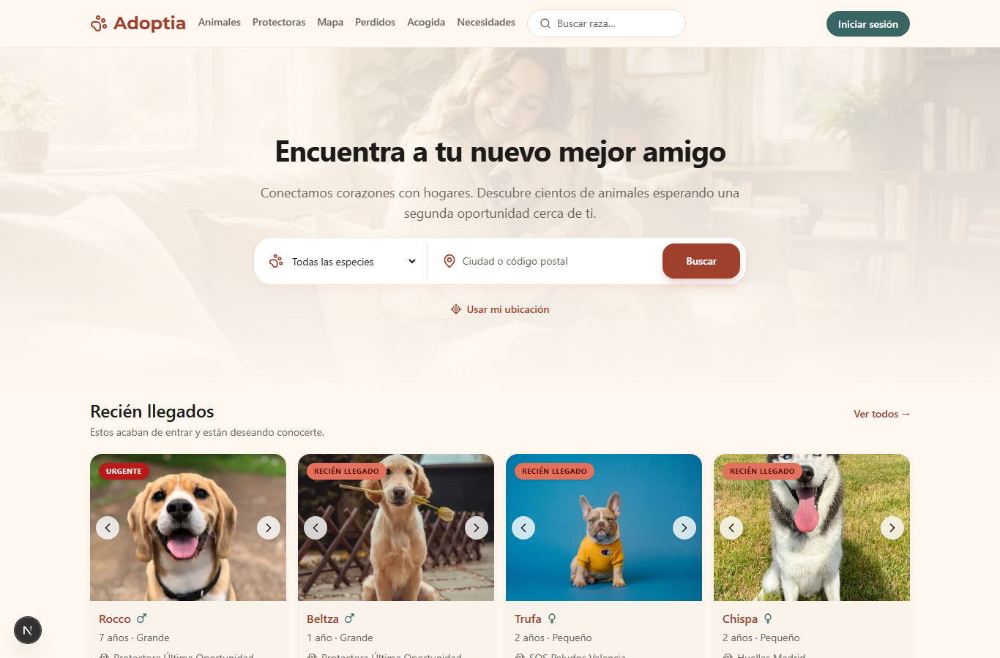

*La plataforma es totalmente adaptable al móvil:*

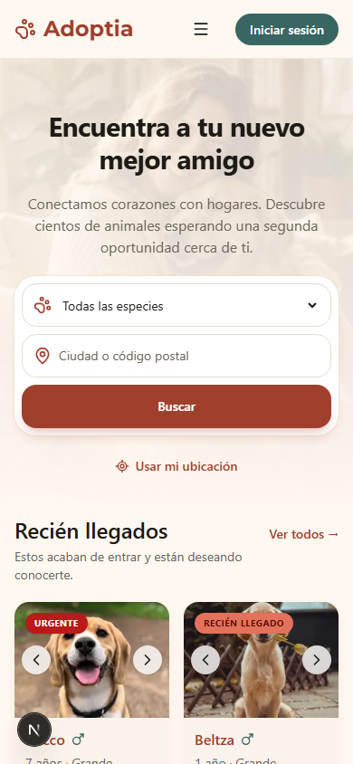

### 1.1 Perfiles de usuario

| Perfil | Qué puede hacer |
|--------|-----------------|
| **Visitante** (sin registro) | Buscar animales, ver fichas, consultar el mapa de protectoras, leer guías, ver anuncios de perdidos y encontrados, suscribirse a alertas por correo |
| **Adoptante** (registro gratuito) | Todo lo anterior + solicitar adopciones, pedir citas, guardar favoritos, apadrinar animales y ofrecerse como casa de acogida |
| **Protectora** (registro + verificación) | Publicar y gestionar animales, recibir y filtrar solicitudes, gestionar agenda y citas, ver estadísticas, difundir en redes |
| **Administración** (equipo Adoptia) | Verificar protectoras, moderar contenido, atender reportes y consultar la auditoría |

### 1.2 Requisitos

Solo se necesita un **navegador web actual** (Chrome, Firefox, Edge o Safari) en ordenador, tablet o móvil. La web es adaptable a cualquier tamaño de pantalla. No hay que instalar nada.

---

## 2. Primeros pasos

### 2.1 Cómo registrarse como adoptante

1. Pulsa **Iniciar sesión / Registro** en la cabecera y elige **Crear cuenta**.
2. Selecciona el perfil **Quiero adoptar**.
3. Introduce tu correo y una contraseña, y completa la verificación anti-robots (casilla de seguridad).
4. Recibirás un **correo de confirmación**: pulsa el enlace para verificar tu cuenta.
5. Tras confirmar, ya puedes iniciar sesión y acceder a **Mi cuenta**.

### 2.2 Cómo registrarse como protectora

1. En el registro, selecciona el perfil **Somos una protectora**.
2. Confirma tu correo igual que un adoptante.
3. Al entrar por primera vez se abre el **asistente de alta** (wizard) en varios pasos:
   - **Datos de la entidad**: nombre, CIF/NIF, descripción, datos de contacto.
   - **Ubicación**: dirección con autocompletado; el mapa sitúa la protectora automáticamente para las búsquedas por proximidad.
   - **Perfil público**: logo, fotos y textos que verán los adoptantes.
4. Al enviar el alta, la solicitud queda **en revisión**. Mientras tanto puedes seguir editando tus datos.
5. El equipo de Adoptia **verifica** la protectora (paso necesario para generar confianza). Recibirás un correo al ser aprobada y tu perfil y animales pasarán a ser visibles públicamente.

### 2.3 Iniciar sesión y recuperar la contraseña

- **Entrar**: pulsa **Iniciar sesión**, introduce correo y contraseña.
- **¿Contraseña olvidada?**: en la pantalla de acceso pulsa **Recuperar contraseña**, introduce tu correo y sigue el enlace del mensaje que recibirás para **establecer una contraseña nueva**.
- **Correo sin verificar**: si no encuentras el correo de confirmación, revisa la carpeta de spam; desde la pantalla de aviso puedes pedir el reenvío.

---

## 3. Guía del adoptante

Con la sesión iniciada, **Mi cuenta** es tu área personal: desde aquí llegas a tus solicitudes, citas, favoritos, alertas y acogidas.

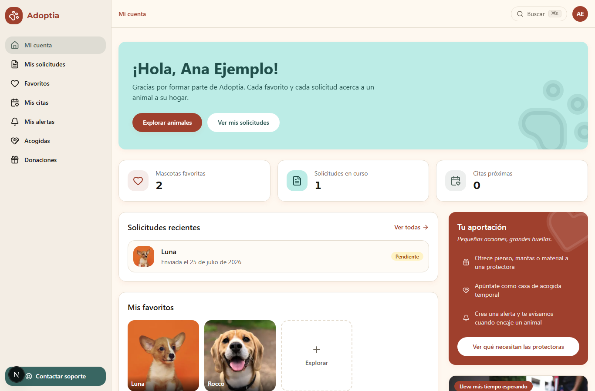

### 3.1 Cómo buscar un animal

1. Entra en **Animales** desde el menú principal.
2. Usa los **filtros**: especie (perro, gato…), tamaño, edad, sexo, provincia, **apto para piso** y otros criterios. También puedes marcar **«Solo urgentes»** para ver antes los casos que más corren.
3. Ordena o filtra por **cercanía** para ver primero los animales de protectoras próximas a ti.
4. Los animales marcados como **urgentes** por su protectora llevan un distintivo «Urgente» y aparecen los primeros cuando ordenas por «recientes».
5. Pulsa cualquier tarjeta para abrir la **ficha completa** del animal.

> **Buscador rápido**: la barra de búsqueda de la cabecera (y, con sesión iniciada, el buscador global) te lleva directo a lo que escribas —una raza, un nombre— sin pasar por los filtros.

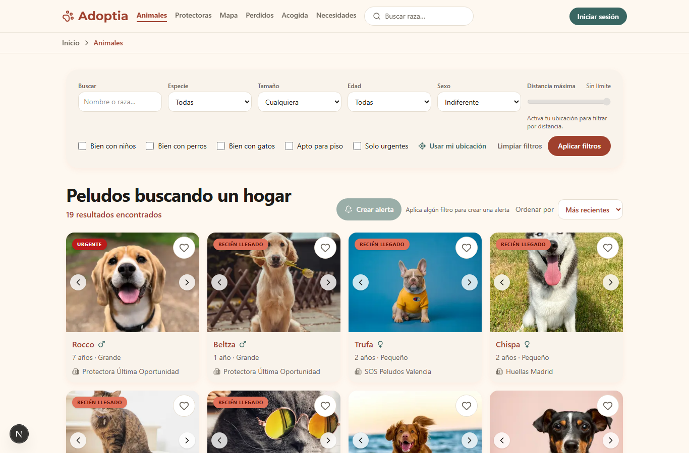

### 3.2 El directorio y el mapa de protectoras

1. Entra en **Protectoras** desde el menú: verás el directorio de protectoras verificadas con su logo, ubicación y cuántos animales tienen en adopción. Pulsa una tarjeta para abrir su **perfil público**.
2. Si prefieres buscarlas por zona, entra en **Mapa**: muestra las mismas protectoras sobre el mapa y los grupos de marcadores se despliegan al acercar el zoom.
3. Pulsa un marcador para ver la tarjeta de la protectora y saltar a su perfil público, donde están todos sus animales.

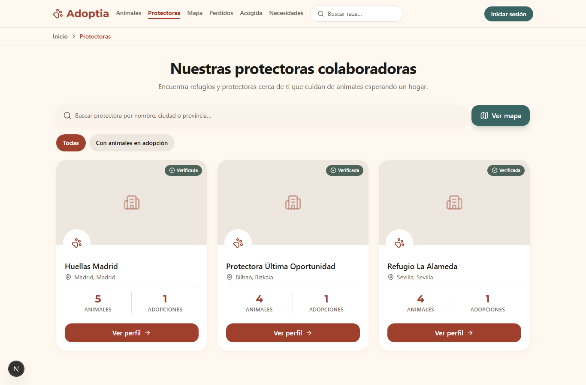

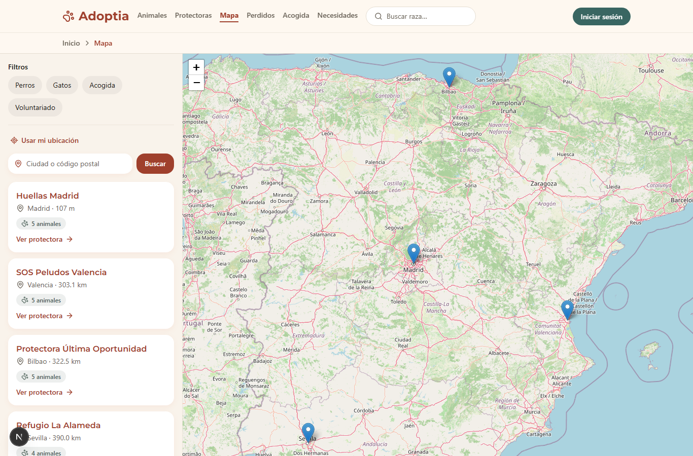

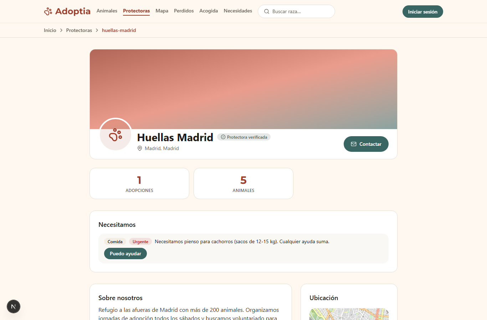

### 3.3 La ficha del animal

Cada ficha incluye: fotos (y vídeo si la protectora lo añadió), nombre, especie, raza, edad, tamaño, sexo, estado de salud, carácter, requisitos de adopción y la protectora responsable con su ubicación aproximada. Desde la ficha puedes:

- **Solicitar la adopción** (botón *Me interesa*).
- **Guardarlo en favoritos** (icono de corazón; requiere sesión iniciada).
- **Apadrinarlo** si la protectora lo permite (ver [3.8](#38-apadrinamiento-y-donaciones)).
- **Compartir** la ficha en redes sociales.
- **Reportar** la publicación si detectas algo inapropiado.

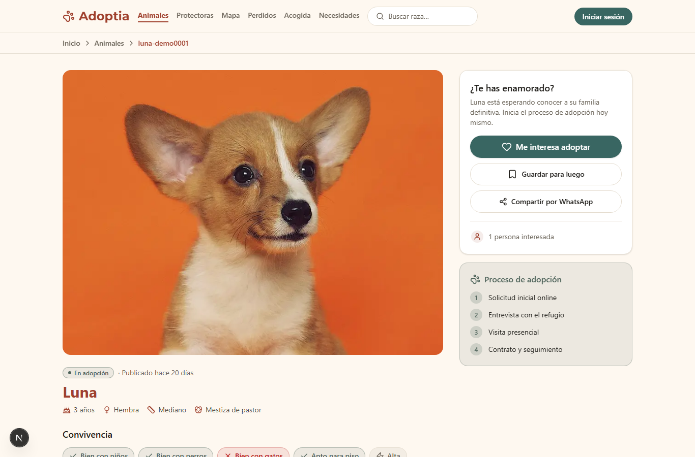

### 3.4 Cómo solicitar una adopción

1. En la ficha del animal pulsa **Me interesa** (necesitas sesión de adoptante).
2. Rellena el **cuestionario de pre-adopción**: tipo de vivienda, experiencia con animales, convivencia, disponibilidad… Sustituye al filtro telefónico que las protectoras hacían a mano.
3. Envía la solicitud. La protectora la recibe en su bandeja y la revisará.
4. Sigue el estado en **Mi cuenta → Solicitudes**: *pendiente*, *aceptada* o *rechazada*. Recibirás un correo con cada cambio.
5. Si la protectora acepta tu solicitud, el siguiente paso es **pedir una cita** para conocer al animal.

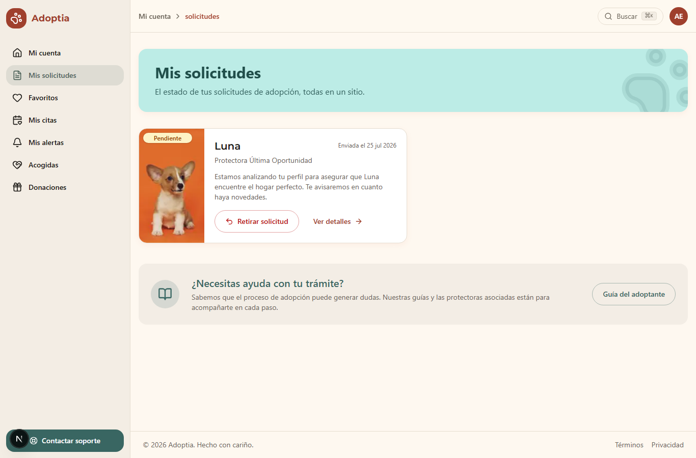

### 3.5 Citas para conocer a un animal

1. Con una solicitud aceptada, entra en **Mi cuenta → Citas → Nueva cita**.
2. El calendario muestra la **disponibilidad real** de la protectora; elige día y hora entre los huecos libres.
3. Confirma la cita. Tanto tú como la protectora recibiréis confirmación por correo y un **recordatorio automático** antes de la cita.
4. Desde **Mi cuenta → Citas** puedes consultar tus citas o cancelarlas si no puedes acudir.

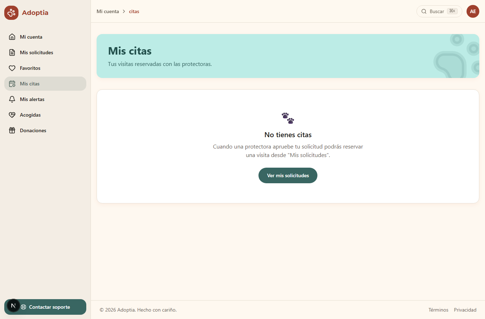

### 3.6 Favoritos

- Pulsa el **corazón** en cualquier ficha o tarjeta para guardar el animal.
- Consulta tu lista en **Mi cuenta → Favoritos**. Si un animal deja de estar disponible, se refleja en la lista.

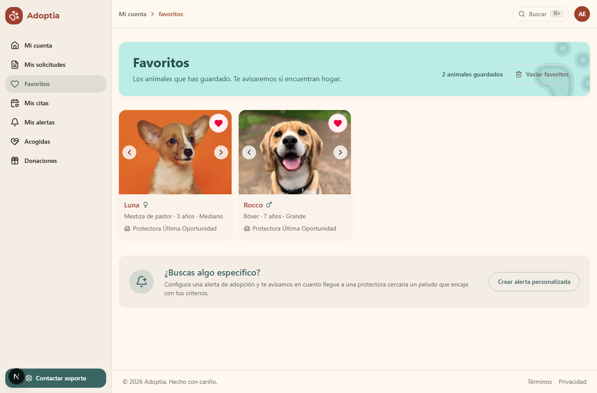

### 3.7 Alertas por correo

¿No encuentras hoy lo que buscas? Crea una **alerta**:

1. Entra en **Alertas** (o desde **Mi cuenta → Alertas** si tienes sesión).
2. Define tus criterios (especie, tamaño, provincia…) y tu correo.
3. Cuando se publique un animal que encaje, recibirás un **aviso por correo**.
4. Todos los correos de alerta incluyen un enlace de **baja en un clic** (página *Alertas → Baja*); también puedes gestionar tus alertas desde tu cuenta.

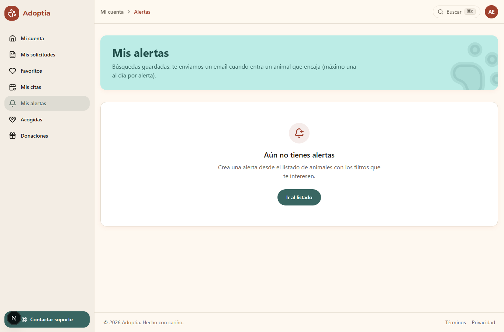

### 3.8 Apadrinamiento y donaciones

Si no puedes adoptar, puedes ayudar igualmente:

- **Apadrinar**: en las fichas de animales apadrinables encontrarás el botón de apadrinamiento, que te pone en contacto con la protectora para colaborar con los gastos del animal.
- **Donar**: los perfiles de protectora muestran sus vías de donación.

### 3.9 Perdidos y encontrados

Tablón público de anuncios de animales perdidos o encontrados:

1. Entra en **Perdidos y encontrados**.
2. Para publicar, pulsa **Nuevo anuncio**: indica si el animal está *perdido* o ha sido *encontrado*, añade fotos, descripción, zona y un contacto.
3. Los anuncios pasan un filtro anti-spam y pueden ser moderados.
4. Quien tenga información usa el contacto del anuncio para avisar. Cuando el caso se resuelva, el anuncio puede marcarse como cerrado.

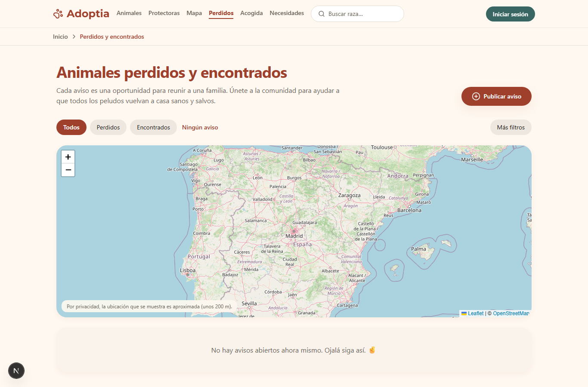

### 3.10 Casas de acogida

Si puedes cuidar temporalmente de un animal:

1. Entra en **Casas de acogida** — desde el **menú principal**, desde tu área personal (**Mi cuenta → Acogidas**) o desde el menú del avatar — y rellena el **registro de casa de acogida**: qué animales puedes acoger, tu vivienda, tu convivencia y tu zona aproximada. La propia pantalla explica en tres pasos cómo funciona y garantiza que tu dirección exacta nunca se comparte.

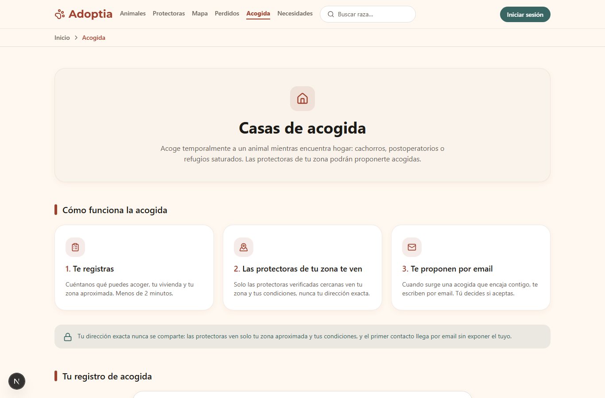
2. Las protectoras de tu zona podrán **proponerte acogidas a través de la plataforma** — recibirás un email con el animal, la duración estimada y un mensaje; tu correo no se muestra públicamente.
3. En esa misma pantalla verás tus **propuestas recibidas** con su estado, y puedes **editar tus condiciones, pausarte** (por ejemplo en vacaciones) **o darte de baja** en cualquier momento.
4. Si ya tienes una acogida en marcha y te surge una emergencia (obras, un viaje inesperado…), pulsa **«Necesito relevo»** sobre esa acogida, cuenta el motivo y hasta cuándo puedes seguir: la protectora recibirá el aviso y buscará otra casa de acogida. Puedes cancelar la petición si tu situación se arregla.

### 3.11 Guías de adopción responsable

En **Guías** encontrarás contenido educativo: qué implica adoptar, cómo preparar la llegada del animal, cuidados básicos, etc. Son artículos públicos pensados para decidir con información.

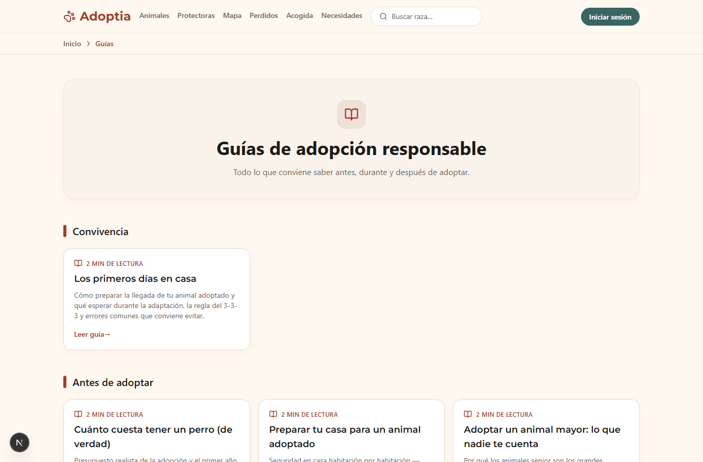

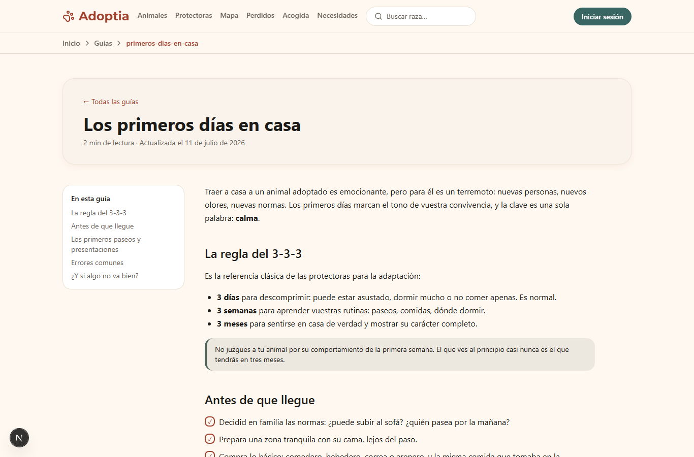

### 3.12 Ayudar con material a las protectoras

Si no puedes adoptar ni acoger pero quieres echar una mano, entra en **Necesidades** (en el **menú principal**): es el tablón donde las protectoras piden **comida, mantas y ropa, medicinas o transporte**, con filtros por categoría, urgencia y ciudad. Las mismas peticiones aparecen en el perfil de cada protectora («Necesitamos»). Pulsa **«Puedo ayudar»** (necesitas cuenta), cuenta qué puedes aportar y tu mensaje llegará a la protectora por email — ten en cuenta que al responderte verá tu dirección de correo.

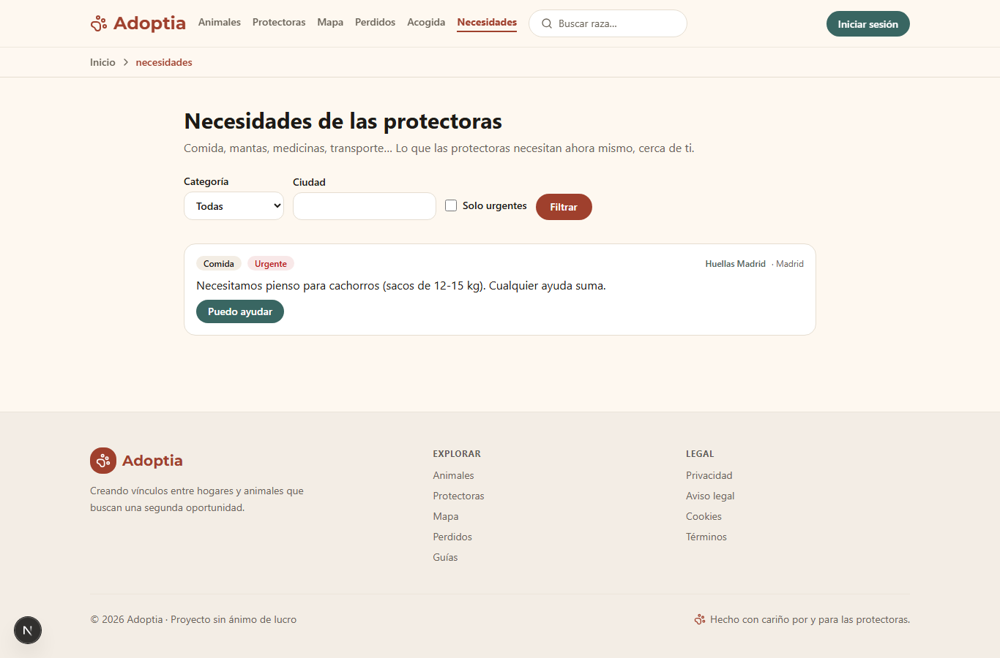

### 3.13 Historias felices

La página de inicio muestra **historias felices**: animales que ya encontraron hogar, con el testimonio de quien los adoptó (o, en su defecto, las últimas adopciones con foto). Es la mejor forma de ver el resultado real de la plataforma. Cuando una adopción se completa a través de Adoptia, la protectora puede publicar el testimonio para que aparezca aquí.

### 3.14 Jornadas de adopción

En **Jornadas** (en el **menú principal**) encuentras los **encuentros presenciales** que organizan las protectoras para que conozcas en persona a los animales que buscan familia. Verás un **listado con mapa**: cada jornada muestra cuándo y dónde es, quién la organiza y cuántos animales van. Abre la ficha de una jornada para ver todos los detalles, los animales que asistirán y su ubicación en el mapa. Si quieres ir, pulsa **«Voy a ir»** (necesitas cuenta) para confirmar tu asistencia — puedes retirarla cuando quieras — y usa **«Compartir»** para enviarle el evento a quien quieras.

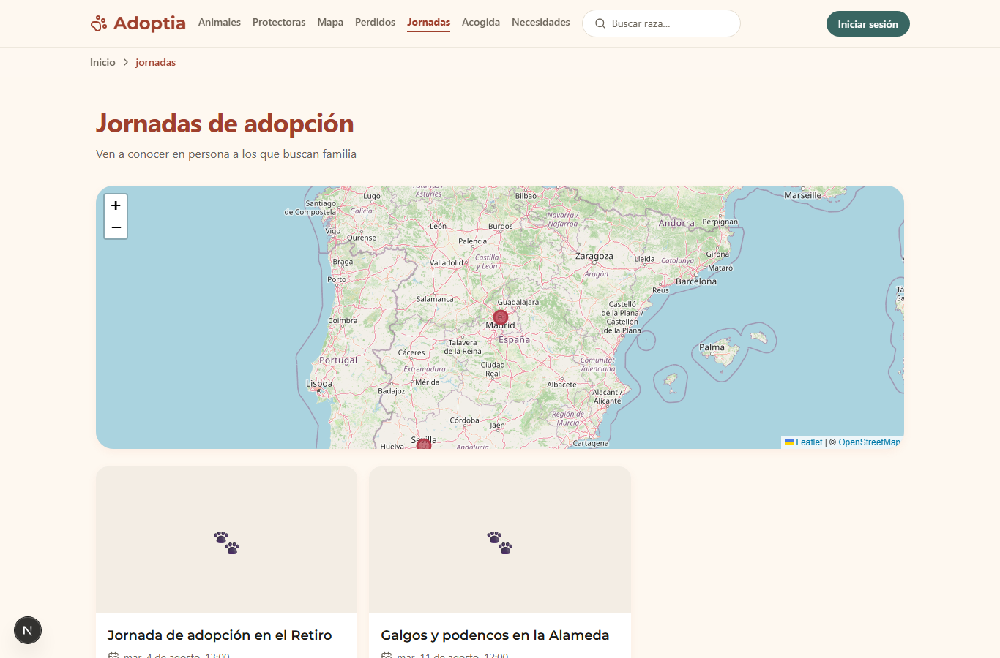

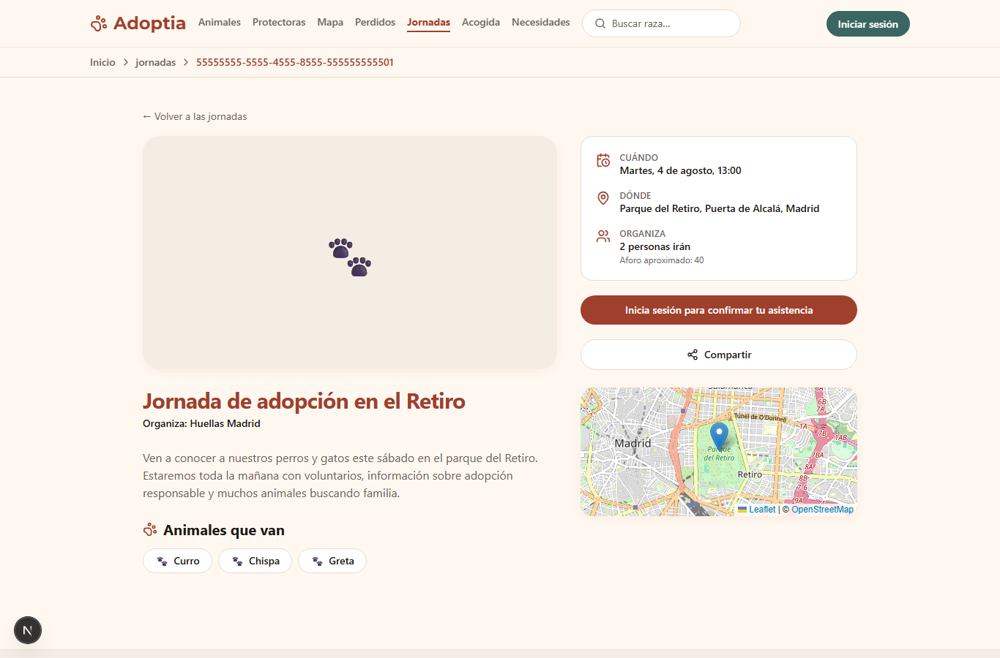

Si confirmas tu asistencia, recibirás un **recordatorio por email el día antes**. Y si tienes una **búsqueda guardada** (tus alertas), te avisaremos por correo cuando se publique una jornada **cerca de tu zona**; puedes darte de baja desde el propio email.

---

## 4. Guía de la protectora

### 4.1 El panel

Tras iniciar sesión, el **Panel** es tu página de inicio: resumen de animales publicados, solicitudes pendientes y próximas citas, con accesos directos a cada sección. La navegación lateral lleva a: **Animales, Solicitudes, Citas, Agenda, Estadísticas, Acogida, Necesidades y Perfil**.

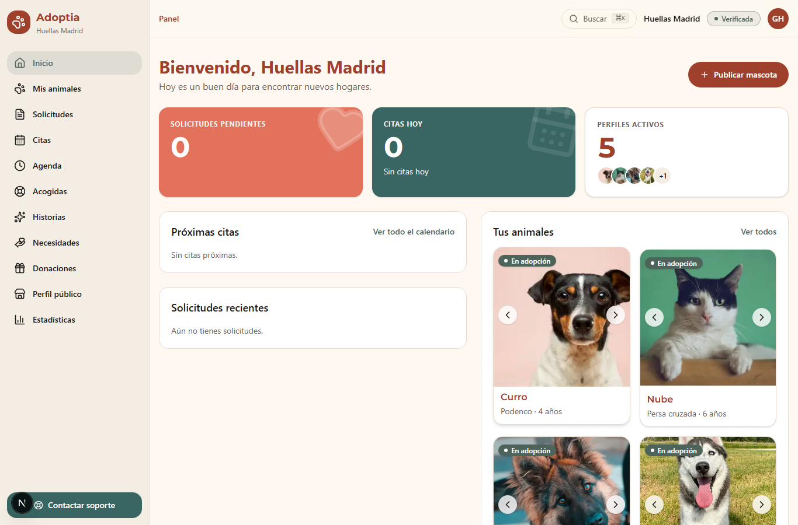

### 4.2 Cómo publicar un animal

1. Entra en **Panel → Animales → Nueva ficha**.
2. Completa la ficha: nombre, especie, raza, edad, tamaño, sexo, salud (vacunas, esterilización, chip), carácter y requisitos de adopción.
3. Sube **fotos** (se comprimen automáticamente) y, si quieres, un **vídeo** corto o un enlace de YouTube.
4. Publica. El animal aparece de inmediato en el buscador público y en tu perfil (si tu protectora está verificada).

Estados de un animal: **publicado** (visible), **reservado** (en proceso de adopción) y **adoptado** (caso cerrado; deja de aparecer en las búsquedas). Cambia el estado desde la ficha en **Panel → Animales**.

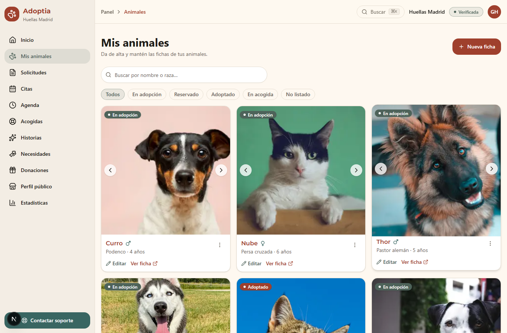

Si un caso corre de verdad (perrera con fecha límite, urgencia médica, refugio saturado), márcalo como **urgente** en la ficha: llevará un distintivo «Urgente» en la tarjeta y saldrá el primero en las búsquedas por «recientes». Úsalo con moderación para que mantenga su fuerza.

### 4.3 Gestionar solicitudes de adopción

1. Entra en **Panel → Solicitudes**: es tu bandeja de entrada, con las solicitudes más recientes primero.
2. Abre una solicitud para leer el **cuestionario completo** del adoptante.
3. **Acepta** o **rechaza** con un motivo opcional. El adoptante recibe el cambio por correo.
4. Al aceptar, el adoptante podrá pedir cita según tu agenda.

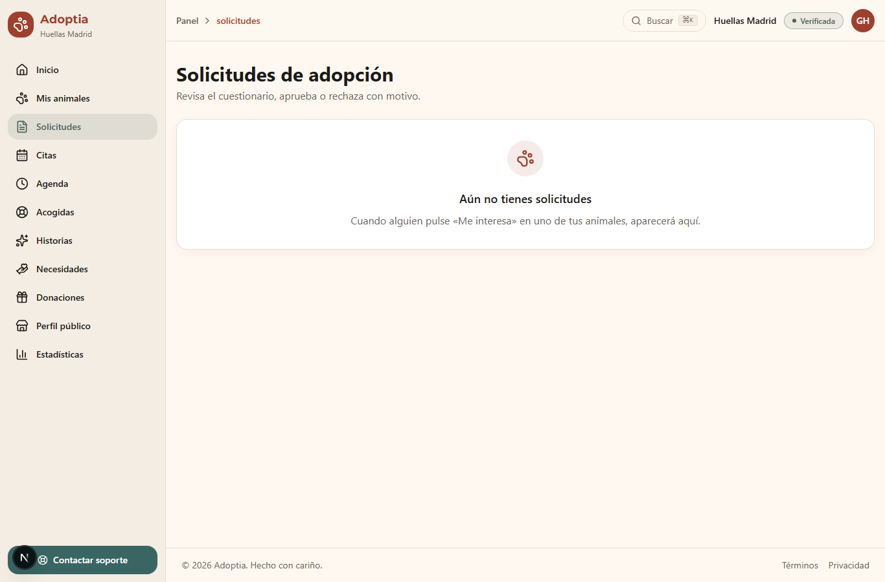

### 4.4 Agenda y citas

- En **Panel → Agenda** define tu **disponibilidad**: días y franjas horarias en las que puedes recibir visitas. La agenda ofrece tres vistas —**Mes** (pintar disponibilidad, festivos, plantillas de horario y copiar/pegar días), **Año** (un vistazo a los 12 meses en mapa de calor) y **Día** (el detalle de las citas de una jornada)— además de un resumen con tu capacidad de huecos y las citas pendientes de hoy.
- En **Panel → Citas** ves las citas confirmadas, puedes cancelarlas si surge un imprevisto y consultar el histórico.
- El sistema envía **recordatorios automáticos** por correo a ambas partes.

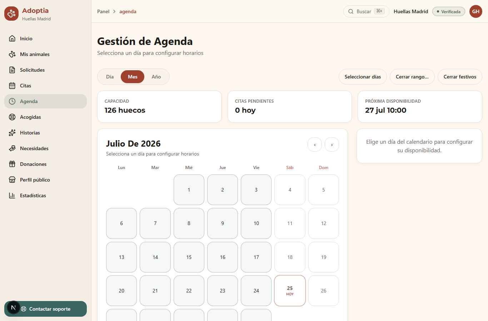

### 4.5 Estadísticas y difusión

En **Panel → Estadísticas** tienes los indicadores de tu actividad: visitas a tus fichas, solicitudes recibidas, adopciones completadas y evolución temporal. Además, cada ficha genera automáticamente una **imagen para redes sociales** (Open Graph) para que compartir un animal luzca bien en cualquier plataforma.

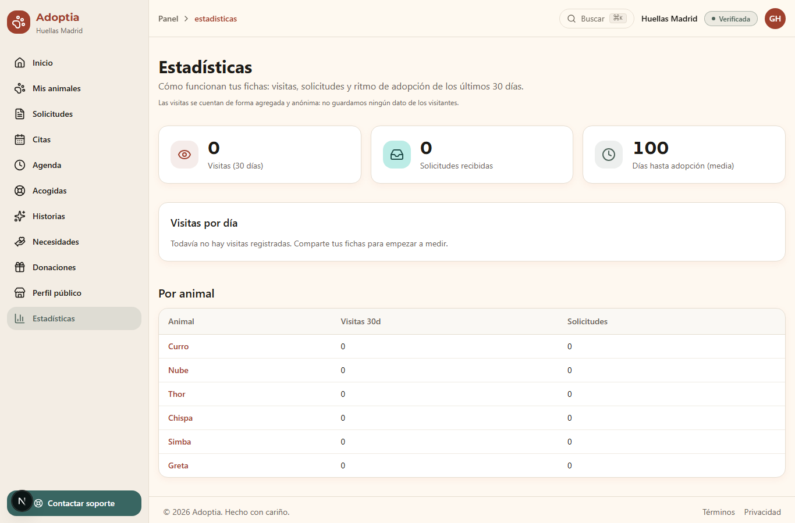

### 4.6 Perfil público

En **Panel → Perfil** editas lo que ven los adoptantes: descripción, fotos, datos de contacto, dirección (con mapa) y vías de donación. La dirección alimenta la **búsqueda por proximidad**: mantenla al día.

### 4.7 Casas de acogida

En **Panel → Acogida** consultas las **casas de acogida registradas** en tu zona y les **propones acogidas** con un formulario (para qué animal, cuánto tiempo y un mensaje); el acogedor recibe el aviso por email. Cada propuesta queda registrada con su estado: mientras esté abierta no puedes reenviarla, y desde el **historial** la marcas aceptada, rechazada o finalizada — así sabes en todo momento qué animales tienes en acogida y con quién. Si una casa de acogida **pide relevo** (emergencia), lo verás con un aviso destacado (motivo y fecha límite) y recibirás un email: propón la acogida a otro acogedor de la zona y, resuelto el relevo, marca la original como finalizada.

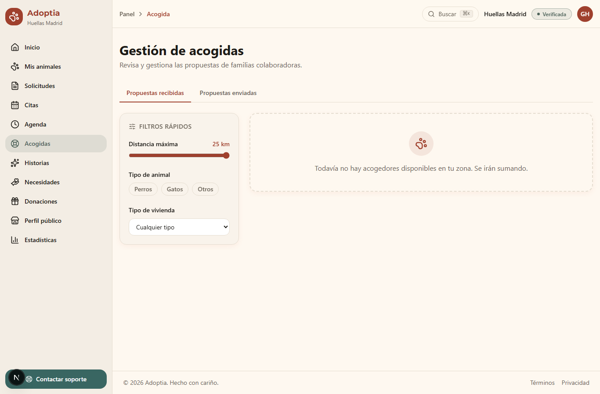

### 4.8 Pedir ayuda material (necesidades)

En **Panel → Necesidades** publicas lo que os hace falta — comida, mantas y ropa, medicinas, transporte u otros — con descripción y marca de **urgente** si toca. Se muestra en vuestro perfil público y en el tablón general de necesidades. Cuando alguien pulse «Puedo ayudar» recibirás su mensaje por email y podrás responderle directamente. Al conseguir lo pedido, márcalo **cubierto**: desaparece del tablón pero queda en vuestro historial (y puedes reabrirlo si vuelve a hacer falta). Disponible para protectoras verificadas.

### 4.9 Jornadas de adopción

En **Panel → Jornadas** organizas **encuentros presenciales de captación** (en una plaza, un parque, una tienda…) para dar a conocer a tus animales. Pulsa **«Nueva jornada»** y completa el formulario, que va por secciones:

1. **Datos**: título, descripción, fecha y hora de inicio y fin, y un aforo aproximado (informativo).
2. **Ubicación**: sitúa en el mapa **el lugar del evento** (no tu sede) — es lo que verá la gente para llegar.
3. **Animales que van**: elige de tu catálogo los que llevarás (opcional; puedes crear una jornada genérica sin animales concretos).
4. **Cartel**: sube una imagen para anunciarla (opcional; se comprime sola).

Puedes **guardar como borrador** y publicar más tarde (para publicar hace falta la ubicación). Una vez publicada, aparece en el listado y el mapa público de `/jornadas` y en la ficha puedes ver **cuánta gente ha confirmado** que asistirá (solo el recuento y la lista, nunca sus correos). Desde el listado del panel editas la jornada o la **cancelas** si surge un imprevisto. Disponible para protectoras verificadas.

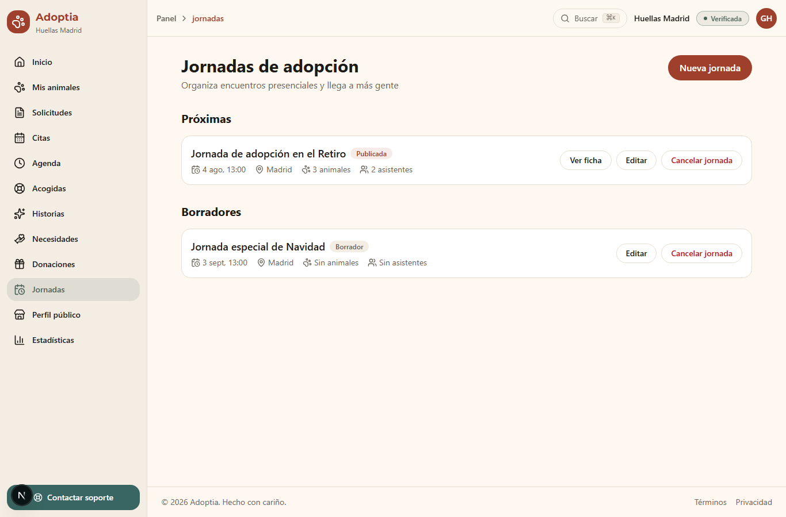

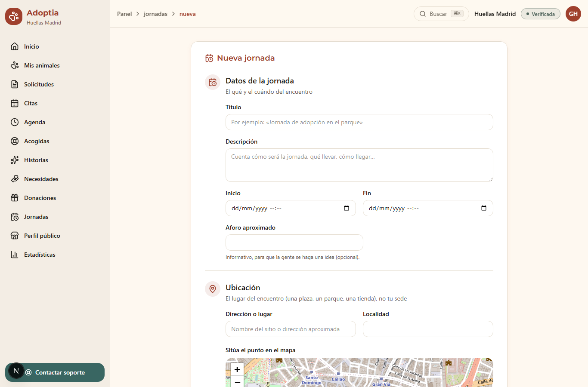

El día antes de la jornada recibirás un **email de recordatorio** con el número de personas que han confirmado su asistencia, para que te hagas una idea de la afluencia.

Cuando la jornada haya terminado, pulsa **«Finalizar»** en la lista y anota el **resultado**: cuántas adopciones se cerraron y cuánta gente asistió. Esos datos aparecen luego en tus **Estadísticas** (tarjeta «Jornadas de adopción») y, si hubo adopciones, en tu **perfil público** como un mensaje de ánimo para futuros adoptantes («en nuestras jornadas, N animales encontraron familia»). Son cifras agregadas: no se comparte ningún dato personal.

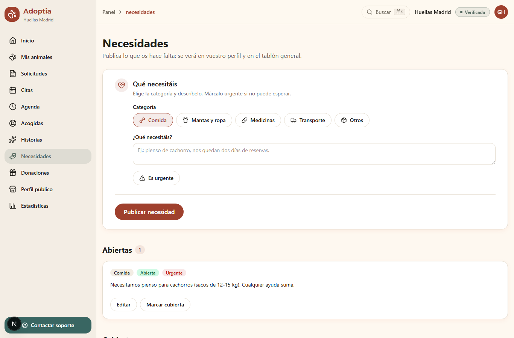

---

## 5. Guía de administración

Sección reservada al equipo de Adoptia (rol administrador).

### 5.1 Verificación de protectoras

1. Entra en **Admin → Protectoras**: lista de altas pendientes de revisión.
2. Revisa los datos de la entidad (nombre, CIF, contacto, ubicación).
3. **Verifica** la protectora (pasa a ser visible públicamente) o recházala indicando el motivo. En ambos casos la protectora recibe un correo.

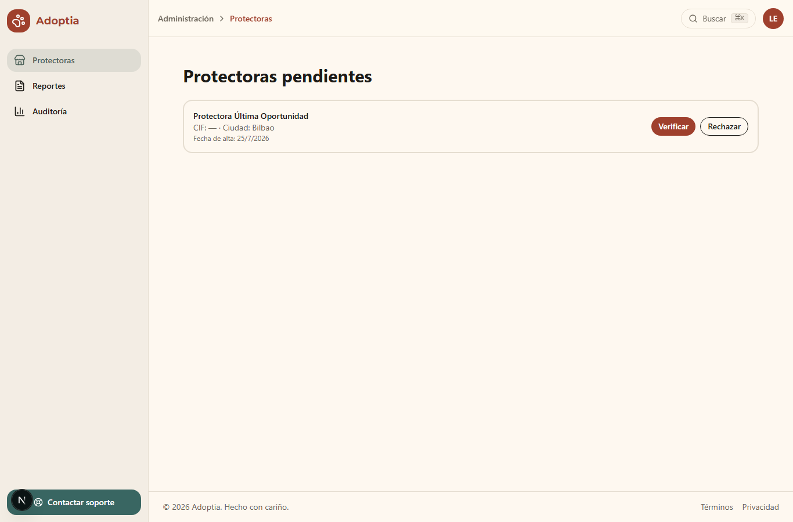

### 5.2 Moderación y reportes

- **Admin → Reportes**: cola de contenido reportado por los usuarios (fichas, anuncios de perdidos y encontrados). Cada reporte puede resolverse retirando el contenido o desestimándose.
- Desde la administración también se pueden **despublicar animales** y **suspender cuentas** que incumplan las normas.

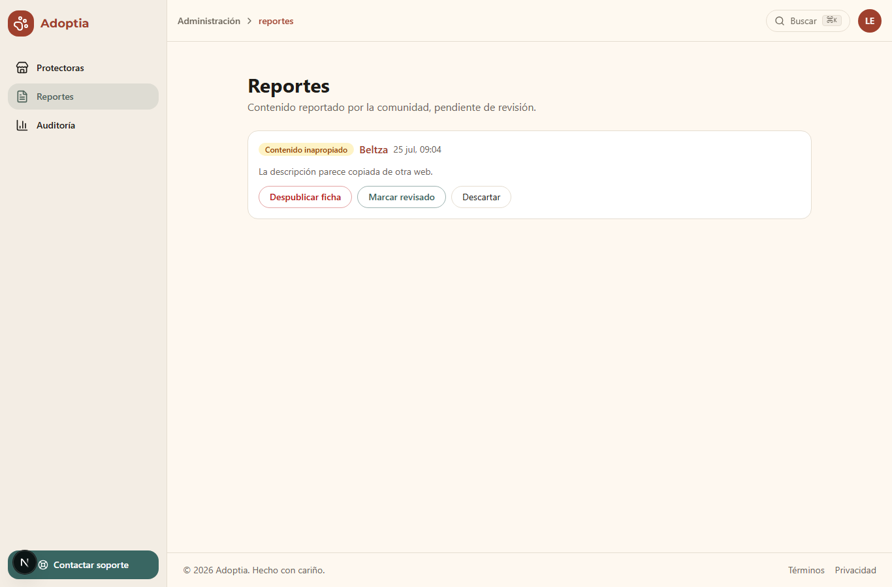

### 5.3 Auditoría

**Admin → Auditoría** registra las acciones sensibles realizadas en la plataforma (verificaciones, moderaciones, suspensiones), con fecha y autor, para poder revisar cualquier decisión a posteriori.

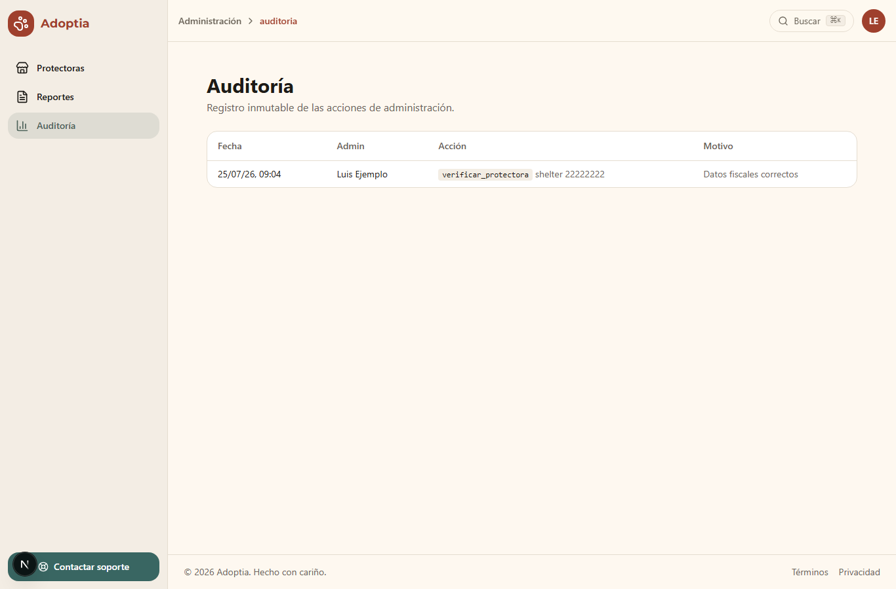

---

## 6. Preguntas frecuentes

**¿Cuánto cuesta usar Adoptia?**
Nada. Es gratuita tanto para adoptantes como para protectoras.

**¿Puedo buscar animales sin registrarme?**
Sí. El registro solo es necesario para solicitar adopciones, pedir citas, guardar favoritos, apadrinar u ofrecerte como casa de acogida.

**¿Por qué no veo una protectora que sé que existe?**
Solo aparecen las protectoras **verificadas** por el equipo de Adoptia. Si es la tuya, completa el alta y espera la verificación.

**He enviado una solicitud y no contesta nadie. ¿Qué hago?**
Las protectoras son entidades con pocos recursos y pueden tardar. El estado real de tu solicitud está siempre en **Mi cuenta → Solicitudes**.

**¿Cómo dejo de recibir correos de alertas?**
Todos los correos de alerta llevan un enlace de baja al pie. Un clic y no recibirás más avisos de esa alerta.

**¿Adoptia gestiona la adopción legal (contrato, chip…)?**
No. Adoptia conecta y organiza el proceso (solicitud, filtro, cita); el contrato de adopción y los trámites se hacen directamente con la protectora.

**He visto un anuncio falso o inapropiado.**
Usa el botón **Reportar** de la ficha o anuncio. El equipo de moderación lo revisará.

---

## 7. Glosario

| Término | Significado |
|---------|-------------|
| **Protectora** | Entidad (asociación, refugio) que rescata y da en adopción animales |
| **Verificación** | Revisión manual del equipo de Adoptia que confirma que una protectora es legítima antes de hacerla visible |
| **Solicitud / "Me interesa"** | Petición de adopción con cuestionario que un adoptante envía por un animal concreto |
| **Cuestionario de pre-adopción** | Formulario sobre vivienda, experiencia y disponibilidad que ayuda a la protectora a filtrar candidatos |
| **Cita** | Visita concertada para conocer a un animal, sobre la agenda de disponibilidad de la protectora |
| **Alerta** | Suscripción por correo a nuevos animales que cumplan unos criterios |
| **Apadrinamiento** | Colaboración económica periódica con un animal concreto sin adoptarlo |
| **Casa de acogida** | Hogar que cuida temporalmente de un animal hasta su adopción |

> ¿Dudas no resueltas? Escribe al correo de soporte que aparece en el pie de la web.
